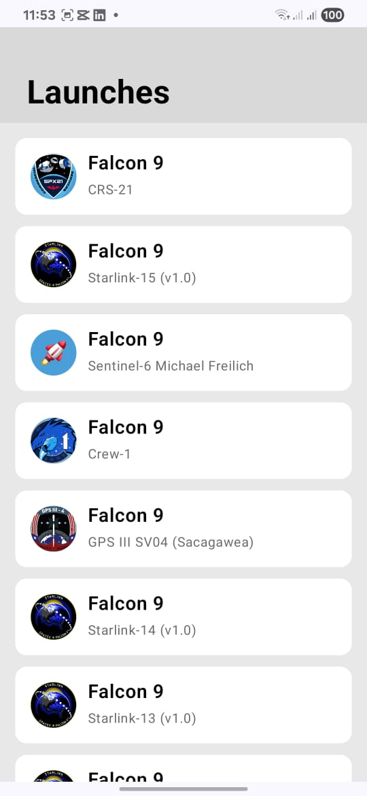
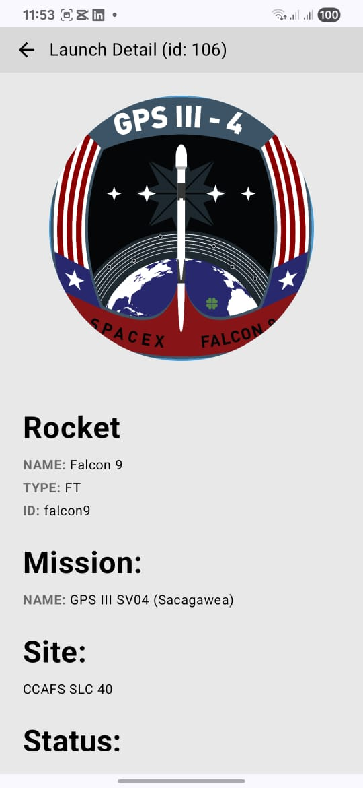
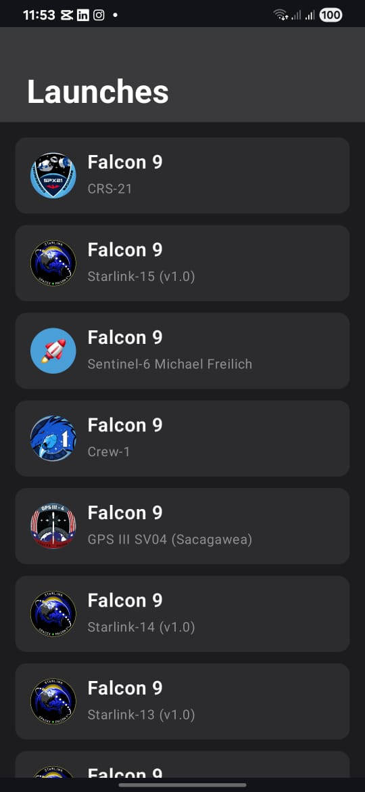
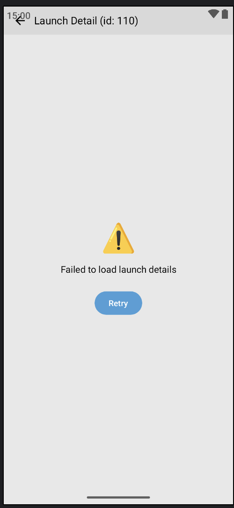
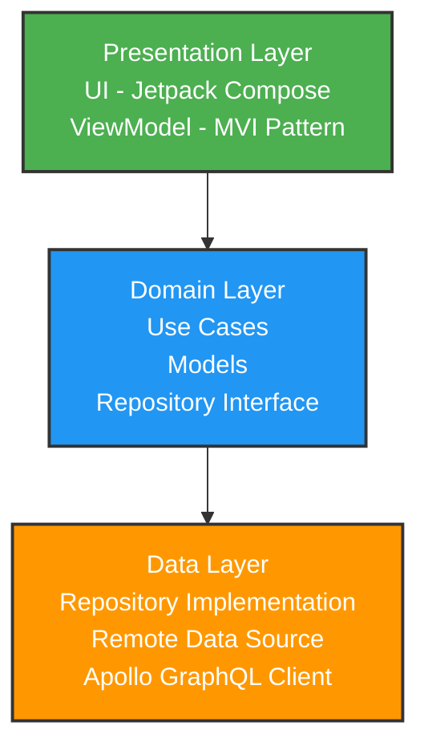

# 🚀 SpaceX Launches Android App

<div align="center">


A modern Android application that displays SpaceX launches using GraphQL API. Built with **Clean Architecture**, **MVI pattern**, and **Jetpack Compose** for a scalable and maintainable codebase.

[Features](#-features) • [Architecture](#️-architecture) • [Tech Stack](#️-tech-stack) • [Getting Started](#-getting-started) • [Screenshots](#-screenshots)

</div>

---

## 📹 Demo Video

<div align="center">

<!-- METHOD 1: GitHub Hosted Video (Upload video via issue/PR drag-drop, then paste URL) -->
https://github.com/user-attachments/assets/6de23c5e-368d-4c10-b1bd-3a42f2f3d92b

</div>

---

## 📱 Screenshots

<div align="center">

### Light Theme
  

### Dark Theme
  

</div>

---

## ✨ Features

<table>
<tr>
<td width="50%">

- 📋 **Browse SpaceX Launches**
  - View all past and upcoming missions
  - Real-time data from GraphQL API
  
- 🔍 **Launch Details**
  - Comprehensive mission information
  - High-resolution mission patches
  
- 🌓 **Dark Mode Support**
  - Seamless theme switching
  - Material Design 3 colors

</td>
<td width="50%">

- 📶 **Offline Support**
  - Apollo normalized cache
  - Works without internet
  
- 🔄 **Error Handling**
  - Graceful error states
  - Retry functionality
  
- ⚡ **Performance**
  - Fast and smooth UI
  - Optimized image loading

</td>
</tr>
</table>

---

## 🏗️ Architecture

<div align="center">



</div>

### 📐 Architecture Layers

<details>
<summary><b>🎨 Presentation Layer</b></summary>

- **UI Components**: Reusable Jetpack Compose components
- **Screens**: Launches List, Launch Detail
- **ViewModels**: MVI pattern (State, Intent, Effect)
- **Theme System**: Material Design 3

```kotlin
// MVI Pattern Example
data class LaunchesListState(
    val launches: List<Launch> = emptyList(),
    val isLoading: Boolean = false,
    val error: String? = null
)

sealed interface LaunchesListIntent {
    object LoadLaunches : LaunchesListIntent
    data class OnLaunchClick(val launchId: String) : LaunchesListIntent
}
```

</details>

<details>
<summary><b>💼 Domain Layer</b></summary>

- **Use Cases**: Business logic encapsulation
- **Models**: Core business entities
- **Repository Interfaces**: Data access contracts

```kotlin
class GetLaunchesUseCase @Inject constructor(
    private val repository: LaunchRepository
) {
    suspend operator fun invoke(): Result<List<Launch>>
}
```

</details>

<details>
<summary><b>🗄️ Data Layer</b></summary>

- **Repository**: Data source coordination
- **Data Sources**: Apollo GraphQL client
- **Mappers**: DTO to Domain model transformation

```kotlin
class LaunchRepositoryImpl @Inject constructor(
    private val remoteDataSource: LaunchRemoteDataSource
) : LaunchRepository
```

</details>

---

## 🛠️ Tech Stack

<table>
<tr>
<td valign="top" width="33%">

### Core
- **Kotlin** - 100% Kotlin
- **Jetpack Compose** - Declarative UI
- **Material Design 3** - Modern UI
- **Coroutines** - Async operations
- **Flow** - Reactive streams

</td>
<td valign="top" width="33%">

### Architecture
- **ViewModel** - State management
- **Navigation Compose** - Type-safe routing
- **Lifecycle** - Lifecycle awareness
- **Dagger Hilt** - Dependency injection

</td>
<td valign="top" width="33%">

### Network & Data
- **Apollo GraphQL v4** - API client
- **OkHttp** - HTTP client
- **Coil** - Image loading
- **Normalized Cache** - Offline support

</td>
</tr>
</table>

---

## 📦 Project Structure

```
com.example.launches/
│
├── 📂 data/                          # Data Layer
│   ├── mapper/                       # DTO to Domain mappers
│   ├── remote/
│   │   ├── apollo/                   # Apollo client setup
│   │   └── datasource/               # Remote data sources
│   └── repository/                   # Repository implementations
│
├── 📂 di/                            # Dependency Injection
│   ├── DataSourceModule.kt
│   ├── NetworkModule.kt
│   └── RepositoryModule.kt
│
├── 📂 domain/                        # Domain Layer
│   ├── model/                        # Business models
│   ├── repository/                   # Repository interfaces
│   └── usecase/                      # Business logic
│
├── 📂 navigation/                    # Navigation
│   ├── NavGraph.kt
│   └── Screen.kt
│
├── 📂 presentation/                  # Presentation Layer
│   ├── detail/                       # Launch detail screen
│   └── list/                         # Launches list screen
│
└── 📂 ui/                            # UI Components
    ├── components/                   # Reusable components
    └── theme/                        # App theming
```

---

## 🚀 Getting Started

### Prerequisites

```bash
Android Studio: Hedgehog (2023.1.1) or newer
JDK: Version 11 or higher
Android SDK: API 24+ (Android 7.0)
Gradle: 8.1+
```

### Installation

1️⃣ **Clone the repository**

```bash
git clone https://github.com/MohamedSoliman1999/spacex-launches-app.git
cd spacex-launches-app
```

2️⃣ **Open in Android Studio**

```
Open Android Studio → Open an Existing Project → Select the cloned folder
```

3️⃣ **Build the project**

```bash
./gradlew build
```

4️⃣ **Run the app**

```bash
./gradlew installDebug
```

Or click the ▶️ **Run** button in Android Studio

---

## 🔧 Configuration

### GraphQL Setup

<details>
<summary>View GraphQL Configuration</summary>

#### Schema Location
```
app/src/main/graphql/schema.graphqls
app/src/main/graphql/GetLaunches.graphql
app/src/main/graphql/GetLaunchDetail.graphql
```

#### API Endpoint
```kotlin
serverUrl = "https://apollo-fullstack-tutorial.herokuapp.com/graphql"
```

#### Sample Query
```graphql
query GetLaunches {
  launches {
    launches {
      id
      mission {
        name
        missionPatch(size: LARGE)
      }
      rocket {
        name
        type
      }
    }
  }
}
```

</details>

---

## 📊 Key Features Implementation

### 🎯 MVI Pattern

```kotlin
// State Management
@HiltViewModel
class LaunchesListViewModel @Inject constructor(
    private val getLaunchesUseCase: GetLaunchesUseCase
) : ViewModel() {
    
    private val _state = MutableStateFlow(LaunchesListState())
    val state = _state.asStateFlow()
    
    fun handleIntent(intent: LaunchesListIntent) {
        when (intent) {
            is LaunchesListIntent.LoadLaunches -> loadLaunches()
            is LaunchesListIntent.OnLaunchClick -> navigateToDetail(intent.launchId)
        }
    }
}
```

### 🖼️ Image Loading

```kotlin
// Coil Integration
AsyncImage(
    model = missionPatch,
    contentDescription = "Mission patch",
    contentScale = ContentScale.Crop,
    modifier = Modifier.size(280.dp)
)
```

### ⚠️ Error Handling

```kotlin
// Result-based Error Handling
result.fold(
    onSuccess = { launches ->
        _state.update { it.copy(launches = launches, isLoading = false) }
    },
    onFailure = { error ->
        _state.update { it.copy(error = error.message, isLoading = false) }
    }
)
```

---

## 🧪 Testing

```bash
# Unit Tests
./gradlew test

# Instrumentation Tests
./gradlew connectedAndroidTest

# Code Coverage
./gradlew jacocoTestReport
```

---

## 📱 App Requirements

| Requirement | Version |
|-------------|---------|
| **Minimum SDK** | API 24 (Android 7.0) |
| **Target SDK** | API 36 (Android 14) |
| **Compile SDK** | API 36 |
| **Kotlin** | 2.0.21 |
| **Gradle** | 8.13.2 |

---

## 🤝 Contributing

Contributions are **welcome**! Here's how you can help:

1. 🍴 Fork the repository
2. 🌿 Create a feature branch
   ```bash
   git checkout -b feature/amazing-feature
   ```
3. 💾 Commit your changes
   ```bash
   git commit -m 'Add amazing feature'
   ```
4. 📤 Push to the branch
   ```bash
   git push origin feature/amazing-feature
   ```
5. 🔃 Open a Pull Request

### Coding Standards

- ✅ Follow [Kotlin Coding Conventions](https://kotlinlang.org/docs/coding-conventions.html)
- ✅ Write meaningful commit messages
- ✅ Add unit tests for new features
- ✅ Update documentation

---

## 📈 Roadmap

- [ ] Unit test coverage (80%+)
- [ ] Search & filter functionality
- [ ] Favorite launches
- [ ] Push notifications
- [ ] Launch countdown timer
- [ ] Video playback integration
- [ ] Analytics integration
- [ ] Multi-language support

---

## 🐛 Known Issues

> 🔍 No major issues currently. If you find any, please [report them here](https://github.com/MohamedSoliman1999/spacex-launches-app/issues).

---

## 📄 License

```
MIT License

Copyright (c) 2024 [Mohamed Soliman]

Permission is hereby granted, free of charge, to any person obtaining a copy
of this software and associated documentation files (the "Software"), to deal
in the Software without restriction, including without limitation the rights
to use, copy, modify, merge, publish, distribute, sublicense, and/or sell
copies of the Software, and to permit persons to whom the Software is
furnished to do so, subject to the following conditions:

The above copyright notice and this permission notice shall be included in all
copies or substantial portions of the Software.

THE SOFTWARE IS PROVIDED "AS IS", WITHOUT WARRANTY OF ANY KIND, EXPRESS OR
IMPLIED, INCLUDING BUT NOT LIMITED TO THE WARRANTIES OF MERCHANTABILITY,
FITNESS FOR A PARTICULAR PURPOSE AND NONINFRINGEMENT.
```

[Full License Text →](LICENSE)

---

## 👨‍💻 Author

<div align="center">

**Mohamed Soliman**

[](https://github.com/MohamedSoliman1999)
[](https://linkedin.com/in/yourprofile)
[](mailto:your.email@example.com)

</div>

---

## 🙏 Acknowledgments

- [SpaceX GraphQL API](https://apollo-fullstack-tutorial.herokuapp.com/) - Data source
- [Apollo GraphQL](https://www.apollographql.com/) - GraphQL client
- [Android Developers](https://developer.android.com/) - Official documentation
- [Material Design](https://material.io/) - Design system

---

## 📚 Additional Resources

| Resource | Link |
|----------|------|
| 📖 Clean Architecture Guide | [Link](https://blog.cleancoder.com/uncle-bob/2012/08/13/the-clean-architecture.html) |
| 🎨 MVI Pattern | [Link](https://www.raywenderlich.com/817602-mvi-architecture-for-android-tutorial-getting-started) |
| 🚀 Jetpack Compose | [Link](https://developer.android.com/jetpack/compose/documentation) |
| 🔮 Apollo Android Docs | [Link](https://www.apollographql.com/docs/kotlin/) |

---

## 💬 Support

<div align="center">

**Need Help?**

[](https://github.com/MohamedSoliman1999/spacex-launches-app/issues)
[](https://github.com/MohamedSoliman1999/spacex-launches-app/discussions)

</div>

---

<div align="center">

### ⭐ Star this repository if you find it helpful!


---

**Made with ❤️ and ☕ by [Mohamed Soliman]**

</div>
